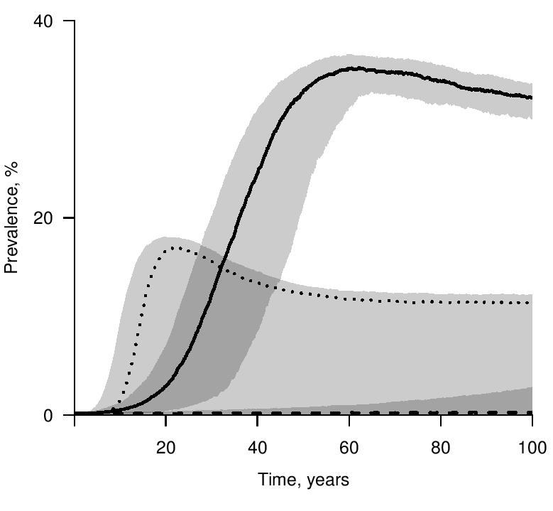

Licensed under the Creative Commons attribution-noncommercial license, http://creativecommons.org/licenses/by-nc/3.0/.
Please share and remix noncommercially, mentioning its origin.  


```{r knitr-opts,include=FALSE,cache=FALSE,purl=FALSE}
library(pomp)
library(knitr)
prefix <- "contacts"
opts_chunk$set(
  progress=TRUE,
  prompt=FALSE,tidy=FALSE,highlight=TRUE,
  strip.white=TRUE,
  warning=FALSE,
  message=FALSE,
  error=FALSE,
  echo=TRUE,
  cache=TRUE,
  cache_extra=rand_seed,
  results='markup',
  fig.show='asis',
  size='small',
  fig.lp="fig:",
  fig.path=paste0("figure/",prefix,"-"),
  cache.path=paste0("cache/",prefix,"-"),
  fig.pos="h!",
  fig.align='center',
  fig.height=4,fig.width=6.83,
  dpi=300,
  dev='png',
  dev.args=list(bg='transparent')
)

set.seed(2050320976)
```
```{r opts,include=FALSE,cache=FALSE}
require(ggplot2)
theme_set(theme_bw())

require(foreach)
require(doParallel)

options(
  keep.source=TRUE,
  encoding="UTF-8"
)

registerDoParallel(cores=4)
mcopts <- list(set.seed=TRUE)
```

----------------------

## Objectives

1. Show how partially observed Markov process (POMP) methods can be used to understand the outcomes of a longitudinal behavioral survey.

2. More broadly, discuss the use of POMP methods for longitudinal data analysis (also known as panel data).

3. Get some practice manipulating models for longitudinal data in the pomp package.


## Introduction

Basic epidemiological models suppose equal contact rates for all individuals in a population. Sometimes these models are extended to permit rate heterogeneity between individuals. Rate heterogeneity within individuals, i.e., dynamic behavioral change, has rarely been considered. Yet, there have been some indications that it plays a substantial role in the HIV epidemic. @romero-severson15 investigated whether dynamic variation in sexual contact rates are a real and measurable phenomenon, by analyzing a large cohort study of HIV-negative gay men in 3 cities [@vittinghoff99]. @romero-severson15 found evidence for dynamic variation. In a simple model for HIV, with a fully mixing population of susceptible and infected individuals, this fitted variation can help explain the observed prevalence history in the US despite the low per-contact infectivity of HIV.

Here, we consider the longitudinal data from @vittinghoff99 on total sexual contacts over four consecutive 6-month periods, for the 882 men having no missing observations. The data are available in [contacts.csv](contacts.csv). Plotted is a sample of 15 time series in the panel:

```{r data}
contact_data <- read.table(file="contacts.csv",header=TRUE)
matplot(t(contact_data[1:15,1:4]),
        ylab="total sexual contacts",xlab="6-month intervals", 
        type="l",xaxp=c(1,4,3))
```

We want a model that can describe all sources of variability in the data:

1. Differences between individuals

2. Differences within individuals over time

3. Over-dispersion: variances exceeding that of a Poisson model

## A model for dynamic variation in sexual contact rates

We use the model of @romero-severson15. We suppose that each individual has a latent rate $X_i(t)$ of making contacts of a specific type.
Each data point, $y_{ij}$, is the number of reported contacts for individual $i$ between time $t_{j-1}$ and $t_j$, where $i=1,\dots,882$ and $j=1,\dots,4$.
The unobserved process $\{X_i(t)\}$ is connected to the data through the expected number of contacts for individual $i$ in reporting interval $j$, which we write as
$$C_{ij}= \alpha^{j-1}\int_{t_{j-1}}^{t_j} X_i(t)\, dt,$$
where $\alpha$ is an additional secular trend that accounts for the observed decline in reported contacts.
A basic stochastic model for homogeneous count data would model $y_{ij}$ as a Poisson random variable with mean and variance equal to $C_{ij}$
[@keeling09].
However, the variance in the data are much higher than the mean of the data [@romero-severson12-scid].
To account for this we assume that the data are negative binomially distributed [@breto11], which is a generalization of a Poisson distribution that allows for increased variance for a fixed mean, leading to the model
$$y_{ij}\sim \mathrm{NegBin}\, \left(C_{ij},D_{i}\right),$$
with mean $C_{ij}$ and  variance $C_{ij}+C_{ij}^2/D_i$.
Here, $D_i$ is called the dispersion parameter, with the Poisson model being recovered in the limit as $D_i$ becomes large.
The dispersion, $D_i$, can model increased variance compared to the Poisson distribution for individual contacts, but does not result in autocorrelation between measurements on an individual over time, which is observed in the data.
To model this autocorrelation, we suppose that individual $i$ has behavioral episodes within which $X_i(t)$ is constant, but the individual enters new behavioral episodes at rate $R_i$. 
At the start of each episode, $X_i(t)$ takes a new value drawn from a Gamma distribution with mean $\mu_X$ and variance $\sigma_X$,
$$X_i(t)\sim \mbox{Gamma}(\mu_X, \sigma_X).$$
To complete the model, we also assume Gamma distributions for $D_i$ and $R_i$,
$$D_i \sim \mbox{Gamma}(\mu_D, \sigma_D),$$
$$R_i \sim \mbox{Gamma}(\mu_R, \sigma_R).$$
The parameters, $\sigma_X$, $\sigma_D$ and $\sigma_R$ control individual-level differences in behavioral parameters allowing the model to encompass a wide range of sexual contact patterns.

The distinction between the effects of the rate at which new behavioral episodes begin, $R_i$, and the dispersion parameter, $D_i$, is subtle since both model within-individual variability.
The signal in the data about distinct behavioral episodes could be overwhelmed by a high variance in number of reported contacts resulting from a low value of $D_i$.
Whether the data are sufficient to identify both $R_i$ and $D_i$ is an empirical question.

### Results: Consequences of dynamic behavior in a simple epidemic model

Consider an SI model for HIV where the contact rates are either (a) constant; (b) vary only between individuals; (c) vary both between and within individuals. In each case, parameterize the model by fitting the behavioral model above, and supplying per-contact infection rates from the literature. Though this model is too simple to draw firm scientific conclusions, it does show the importance of the issue:



Fig 4 of  @romero-severson15. The median of 500 simulations are shown as lines and the $75^{th}$ and $25^{th}$ quantiles are shown as gray envelopes for three parameterizations. 

* 'Homogeneous' (dashed line): the epidemic was simulated where $\mu_X$ is estimated by the sample mean (1.53 $\mathrm{month}^{-1}$) without any sources of between-individual or within-individual heterogeneity.

* 'Between Heterogeneity' (dotted line): the epidemic was simulated where $\mu_X$ is estimated by the sample mean (1.53 $\mathrm{month}^{-1}$) and $\sigma_X$ is estimated by the sample standard deviation (3.28 $\mathrm{month}^{-1}$)

* 'Within+Between Heterogeneity' (solid line): the epidemic was simulated where each parameter is set to the estimated maximum likelihood estimate for total contacts.

For all situations, the per contact probability of transmission was set to 1/120, the average length of infection was set to 10 years, and the infection-free equilibrium population size was set to 3000. The per contact probability was selected such that the basic reproduction number in the the 'Homogeneous' case was 1.53. In the 'Homogeneous', 'Between Heterogeneity', `Within+Between Heterogeneity' cases respectively 239/500 and 172/500, 95/500 simulations died out before the 100 year mark.

## Three ways to represent a longitudinal model as a POMP.

Partially observed Markov process (POMP) models provide a general framework for mechanistic modeling of time series data [@breto09].

* Recall the basic POMP model: a latent Markov process $\{X(t),0\le t < \infty\}$ from which a sequence of measurements $Y_{1:N}=(Y_1,\dots,Y_N)$ is generated at times $t_{1:N}=(t_1,\dots,t_N)$.
The time series data $y_{1:N}$ are modeled as a realization of $Y_{1:N}$.

* Formally, the framework for a longitudinal POMP model extends that for a time series POMP model. 
The data are $\{y_{i,j}\}$, where each panel member $i\in\{1,\dots,I\}$ has a scalar or vector valued observation at times $t_{i,j}$ for $j\in\{1,\dots,J_i\}$.
Each panel member is modeled as an independent POMP model, with latent process $\{X_i(t)\}$ and observable random variables $\{Y_{i,j}\}$.

Within this general framework, we can identify 3 approaches to building a POMP from a longitudinal POMP (see Web Appendix 2 of @romero-severson15).

1. Treat the panel members as an iid, vector-valued, POMP by setting 
$$X(i) = \big( X_i(t_{i,1}),\dots,X_i(t_{i,J_i}) \big),$$
$$Y_i = \big( Y_{i,1},\dots,Y_{i,J_i} \big).$$
The construction is a valid POMP because it is only necessary to define $X(t)$ at the times of observations. In this setting, "time" is progression through the $I$ panel members. For each "time" $i$, the vector-valued latent process is an independent draw from $\big(X_i(t_{i,1}),\dots,X_i(t_{i,J_i})\big)$.
If $J_i$ is small for each $i$, sequential Monte Carlo may be computationally feasible.

2. Chain together the $I$ panel members, setting
$$X(t) = \left\{\begin{array}{ll}
X_1(t) & \mbox{for $0\le t\le t_{1,J_1}$} \\
X_2(t-t_{1,J_1}) & \mbox{for $t_{1,J_1}\le t\le t_{1,J_1}+t_{2,J_2}$} \\
\vdots & \vdots \\
X_I\Big(t-\sum_{i=1}^{I-1}t_{i,J_i} \Big)& 
\mbox{for $t-\sum_{i=1}^{I-1}t_{i,J_i}\le t\le \sum_{i=1}^{I}t_{i,J_i}$}
\end{array}
\right.$$ 
with a corresponding chaining of the $K$ observation processes.


3. If each individual has the same measurement times (i.e., we can write $t_{i,j}=t_j$) then one could concatenate the latent and observation processes, setting $X(t)=\big(X_1(t),\dots,X_I(t)\big)$ and $Y_j=\big(Y_{1,j},\dots,Y_{I,j}\big)$. 
This results in high-dimensional latent and measurement processes, which is numerically problematic for the sequential Monte Carlo methods used by iterated filtering and PMCMC [@bengtsson08].

## Building a pomp object for panel data: Approach 1

**pomp** is an **R** package for time series data analysis, focusing on the use of POMP models [@king15]. 
**pomp** is available from [CRAN](http://cran.r-project.org/web/packages/pomp), with development versions available from [github](http://kingaa.github.io/pomp).
Here, we use **pomp** version `r packageVersion("pomp")`

```{r package}
require(pomp)
packageVersion("pomp")
```

@romero-severson15 implemented the above Approach 1. We proceed to use this approach to build a pomp object using C snippets. In this approach, we code the state and observation variable names are as follows:

```{r statenames}
contact_statenames = c("X","D","R","C1","C2","C3","C4")
contact_obsnames = c("y1", "y2", "y3", "y4")
```

As a test set of parameters, we will use the MLE for total contacts reported in the top row of table 1 of @romero-severson15:

```{r params}
contact_paramnames = c("mu_X","sigma_X","mu_D","sigma_D","mu_R","sigma_R","alpha")
contact_mle <- c(
  mu_X = 1.75,
  sigma_X = 2.67,
  mu_D = 3.81,
  sigma_D = 4.42,
  mu_R = 0.04,
  sigma_R = 0,
  alpha = 0.90
)
```

First, let's specify the dynamic model:

```{r rprocess}
contact_rprocess <- Csnippet("
  double C[4] = {0,0,0,0}, tol=0.000001; 
  int j;
  double Z, Zcum;

  D = (sigma_D < tol || mu_D < tol) ? mu_D : rgamma( pow(mu_D, 2) / pow(sigma_D, 2) , pow(sigma_D, 2) / mu_D );
  R = (sigma_R < tol || mu_R < tol) ? mu_R : rgamma( pow(mu_R, 2) / pow(sigma_R, 2) , pow(sigma_R, 2) / mu_R );
  X = (sigma_X < tol || mu_X < tol) ? mu_X : rgamma( pow(mu_X, 2) / pow(sigma_X, 2) , pow(sigma_X, 2) / mu_X );
  Z = (R < tol) ? 1/tol : rexp(1/R);
  for(j=0;j<4;j++){
    Zcum = Z;
    while(Zcum < 6){
       C[j] += Z * X;
       Z = (R < tol) ? 1/tol : rexp(1/R);
       X = (sigma_X < tol || mu_X < tol) ? mu_X : rgamma( pow(mu_X, 2) / pow(sigma_X, 2) , pow(sigma_X, 2) / mu_X );
       Zcum += Z;
    }
    C[j] += (6 - (Zcum - Z)) * X;
    C[j] *= pow(alpha,j); 
    Z = Zcum - 6;
  }
  C1 = C[0]; C2 = C[1]; C3 = C[2]; C4 = C[3];
")
```

And now the measurement model:

```{r measure}
contact_dmeasure <- Csnippet("
  double y[4] = {y1,y2,y3,y4};
  double C[4] = {C1,C2,C3,C4};
  int j;
  lik = 0;
  for(j=0;j<4;j++) lik += dnbinom(y[j], D, D/(D+C[j]), 1);
  lik = give_log ? lik : exp(lik);
")

contact_rmeasure <- Csnippet("
  double y[4];
  double C[4] = {C1,C2,C3,C4};
  int j;
  for(j=0;j<4;j++) y[j] = rnbinom(D, D/(D+C[j]));
  y1=y[0]; y2=y[1]; y3=y[2]; y4=y[3];
")
```

We can now build a pomp object corresponding to total contacts:

```{r pomp}
contacts <- pomp(
  data=contact_data,
  times="individual",
  t0=0,
  params=contact_mle,
  rprocess = discrete.time.sim(step.fun=contact_rprocess,delta.t=1),
  dmeasure = contact_dmeasure,
  rmeasure = contact_rmeasure,
  obsnames = contact_obsnames,
  statenames = contact_statenames,
  paramnames = contact_paramnames,
  initializer = function (params, t0,  ...) c(X=0,D=0,R=0,C1=0,C2=0,C3=0,C4=0)
) 

plot(contacts)
```

As one check on the coding, and to investigate the fitted model, we can simulate from this pomp object. We can also check that the sample mean values of the parameters approximate their model means:

```{r simulate}
s1 <- simulate(contacts,seed=1)
apply(obs(s1),1,mean)
apply(states(s1),1,mean)
plot(s1)
```

To check that this implementation of the model is consistent with the AJE version, we can check that the log likelihood at the MLE matches (to a reasonable approximation) the value of -9552.1 reported by @romero-severson15. 
On the assumption one is working on a multi-core machine, one might as well do some parallelization to put the cores to work and get smaller Monte Carlo errors for a given amount of patience.
Regardless of one's degree of patience, or the nature of one's hardware, however, it is always a good idea, before embarking on an expensive computation, to arrange to save the results.
The `stew` function, provided by **pomp**, does this.
If the named file does not exist, the indicated computation is performed, and the results are saved in a file of that name.
If the named file exists, these computations are not performed, but the file containing previously computed results is loaded.

```{r pfilter1}
stew("pfilter1.rda",{
  
  t1 <- system.time(
    pf1 <-    foreach(i=1:10,.packages='pomp',
                      .options.multicore=mcopts) 
    %dopar% try(pfilter(contacts,Np=2000))
  )
  
},seed=1943810296,kind="L'Ecuyer")

(loglik1 <- sapply(pf1,logLik))
```

We don't require parameter transformations to do filtering. However, for optimization, it is useful to set them up as follows:

```{r transformations}
contact_toEstimationScale <- Csnippet("
  Tmu_X = log(mu_X);
  Tsigma_X = log(sigma_X);
  Tmu_D = log(mu_D);
  Tsigma_D = log(sigma_D);
  Tmu_R = log(mu_R);
  Talpha = log(alpha/(1-alpha));
")

contact_fromEstimationScale <- Csnippet("
  Tmu_X = exp(mu_X);
  Tsigma_X = exp(sigma_X);
  Tmu_D = exp(mu_D);
  Tsigma_D = exp(sigma_D);
  Tmu_R = exp(mu_R);
  Talpha = exp(alpha)/(1+exp(alpha));
")

contacts_with_trans <- pomp(contacts,
                            paramnames = contact_paramnames,
                            fromEstimationScale=contact_fromEstimationScale,
                            toEstimationScale=contact_toEstimationScale
)
```

## Building a pomp object for panel data: Approach 2

In this formulation, the states and observations are

```{r statenames2}
contact2_statenames = c("X","D","R","C","Z")
contact2_obsnames = "y"
```

The dynamic model is coded as

```{r rprocess2}
contact2_rprocess <- Csnippet("
  double Zcum, tol=0.000001;
  if( (int)t % 4 == 0) { 
    D = (sigma_D < tol || mu_D < tol) ? mu_D : 
          rgamma(pow(mu_D/sigma_D,2), pow(sigma_D,2)/mu_D);
    R = (sigma_R < tol || mu_R < tol) ? mu_R : 
          rgamma(pow(mu_R/sigma_R, 2), pow(sigma_R, 2)/mu_R);
    X = (sigma_X < tol || mu_X < tol) ? mu_X : 
          rgamma(pow(mu_X/sigma_X, 2), pow(sigma_X, 2)/mu_X);
    Z = (R < tol) ? 1/tol : rexp(1/R);
  }
  C = 0;
  Zcum = Z;
  while(Zcum < 6){
       C  += Z * X;
       Z = (R < tol) ? 1/tol : rexp(1/R);
       X = (sigma_X < tol || mu_X < tol) ? mu_X : 
             rgamma(pow(mu_X/sigma_X, 2), pow(sigma_X, 2)/mu_X);
       Zcum += Z;
  }
  C += (6 - (Zcum - Z)) * X;
  C *= pow(alpha, (int)t % 4 ); 
  Z = Zcum - 6;
")
```

and the measurement model is

```{r measurement2}
contact2_dmeasure <- Csnippet("
  lik = dnbinom(y, D, D/(D+C), give_log);
")

contact2_rmeasure <- Csnippet("
  y = rnbinom(D, D/(D+C));
")
```

The parameters remain the same, and we can now build the pomp object:

```{r pomp2}
contacts2 <- pomp(
  data=read.table(file="contacts2.csv",header=TRUE),
  times="obs",
  t0=0,
  params=contact_mle,
  rprocess = discrete.time.sim(step.fun=contact2_rprocess,delta.t=1),
  dmeasure = contact2_dmeasure,
  rmeasure = contact2_rmeasure,
  obsnames = contact2_obsnames,
  statenames = contact2_statenames,
  paramnames = contact_paramnames,
  fromEstimationScale=contact_fromEstimationScale,
  toEstimationScale=contact_toEstimationScale,
  initializer = function (params, t0,  ...) c(X=0,D=0,R=0,C=0,Z=0)
) 

plot(contacts2)
```

Now we can simulate from the model:

```{r simulateVersion2}
s2 <- simulate(contacts2,seed=2)
apply(obs(s2),1,mean)
apply(states(s2),1,mean)
plot(s2)
```

and we can filter, to obtain the likelihood:

```{r pfilter2}
stew("pfilter2.rda",{

  t2 <- system.time(
    pf2 <- foreach(i=1:10,.packages='pomp',
                   .options.multicore=mcopts) 
    %dopar% try(pfilter(contacts2,Np=2000))
  )

},seed=1092903614,kind="L'Ecuyer")

(loglik2 <- sapply(pf2,logLik))
```

### Likelihood maximization using the IF2 algorithm

As an example of an iterated filtering investigation, let's carry out a local search, starting at the current estimate of the MLE.
```{r mif}
stew("mif1.rda",{

  t3 <- system.time(
    m2 <- foreach(i=1:10,.packages='pomp',
                  .options.multicore=mcopts) %dopar% try( 
                    mif2(contacts2,
                         Nmif=10,
                         Np=200,
                         cooling.fraction.50=0.5,
                         cooling.type="geometric",
                         transform=TRUE,
                         rw.sd=rw.sd(mu_X=0.02,
                                     sigma_X=0.02,
                                     mu_D = 0.02,
                                     sigma_D=0.02,
                                     mu_R=0.02,
                                     sigma_R =0.02,
                                     alpha=0.02)
                    )
                  )
  )
  
  params_new <- coef( m2[[which.max( sapply(m2,logLik) )]] )
  
  pf3 <- foreach(i=1:10,.packages='pomp',
                 .options.multicore=mcopts) %dopar% try(
                   pfilter(contacts2,params=params_new,Np=1000)
                 )

},seed=354320731,kind="L'Ecuyer")

(loglik_new <- logmeanexp(sapply(pf3,logLik),se=TRUE))
```
This is a relatively quick search, taking only `r round(t3["elapsed"],1)` seconds. The preliminary likelihood estimated as a consequence of running `mif2` and extracted here by `sapply(m2,logLik)` does not correspond to the actual, fixed parameter, model. It is the sequential Monte Carlo estimate of the likelihood from the last filtering iteration, and therefore will have some perturbation of the parameters. Further, one typically requires fewer particles for each filtering iteration than necessary to obtain a good likelihood estimate---stochastic errors can cancel out through the filtering iterations, rather than within any one iteration. For promising new parameter values, it is desirable to put computational effort into evaluating the likelihood sufficient to make the Monte Carlo error small compared to one log unit.


## Comparison of Approaches 1 and 2

We are most directly interested in which method is best when we wish to carry out inference by iterated filtering. However, a more easily tested proxy for that is to see which method is more compuationally efficient for filtering.
For approach 1, the log likelihood estimates had mean `r round(mean(loglik1),1)` and sd `r round(sd(loglik1),1)` and took `r round(t1["elapsed"],1)` seconds.
For method 2, the log likelihood estimates had mean `r round(mean(loglik2),1)` and sd `r round(sd(loglik2),1)` and took `r round(t2["elapsed"],1)` seconds.

For this model, we find that Method 2 and Method 3 are quite comparable. 
A possible explanation for this is that the main Monte Carlo challenge in this situation is the time-constant random effects for each individual: $D$ is a truly time-constant random effect; the initial choice of $X$ is a slowly varying random effect, since $1/\mu_R$ is on the same timescale as the total observation length.
For time-constant random effects, there may be not much additional value to the resampling carried out by method 2 within the time series for each individual. This resampling is the main difference between methods 2 and 3.


## Technical exercise: Practical implications of the unbiasedness of the particle filter and the concavity of the logarithm

One can check that the most basic importance sampling method gives an unbiased Monte Carlo estimate. However, the self-normalization of weights involved in sequential Monte Carlo is a nonlinear operation and therefore usually introduces bias. Surprisingly, it can be shown that the estimate of the likelihood arising from sequential Monte Carlo is unbiased.

For inferential purposes, we usually work with the log likelihood. Due to Jensen's inequality, SMC has a negative bias as an estimator of the log likelihood, i.e., it systematically underestimates the log likelihood. Usually, the higher the Monte Carlo error on the likelihood, the larger this bias.

(a) Calculate empirically the mean and standard deviation of the log likelihood estimate at the MLE using 100 filter replications each with 1000 particles, using each of Method 1 and Method 2.

(b) Do you find the anticipated relationship between means and variances for the methods?

(c) Given $K$ replicates of the SMC log likelihood estimate, $\{\hat\lambda_k,k=1,\dots,K\}$, an obvious Monte Carlo estimator of the true log likelihood, $\lambda$, is
$$\hat\lambda = (1/K)\sum_{k=1}^K \hat\lambda_k.$$
Is there a better way to estimate  $\lambda$?
If so, how do you get a standard error to measure the Monte Carlo error on your improved estimator?

(d) Suppose you have a fixed computational budget of 
$(\# \mathrm{replications}) \times (\# \mathrm{particles}) = 10^6$.
How would you allocate this effort to get a log likelihood estimate that is both good and quantified to be good? Hint: check out the `logmeanexp` function in the pomp package.

## Technical exercise: Ability to filter as a proxy for ability to carry out inference

The main inferential challenge in a maximum likelihood approach for POMP models is to identify an MLE. Methods such as iterated filtering and PMCMC are based on sequential Monte Carlo. Therefore, these methods are usually applicable if and only if one has a decent SMC algorithm available. Quantifying success at filtering, e.g., by considering the variance of the SMC likelihood estimator, is considerably quicker and easier than quantifying success at optimization or posterior distribution reconstruction. Therefore, it is natural to carry out an investigation such as the previous exercise and conclude that Approach 2 is probably preferable for inference.

Carry out a simple experiment to see whether you can conclude Approach 2 is indeed better for iterated filtering in the context of this model and data. Obtain error estimates to assess whether your evidence is significant despite Monte Carlo uncertainty.


----------------------

## References


