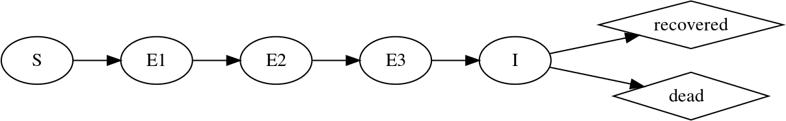

\newcommand\prob[1]{\mathbb{P}\left[{#1}\right]}
\newcommand\expect[1]{\mathbb{E}\left[{#1}\right]}
\newcommand\var[1]{\mathrm{Var}\left[{#1}\right]}
\newcommand\dist[2]{\mathrm{#1}\left(#2\right)}
\newcommand\dlta[1]{{\Delta}{#1}}
\newcommand\scinot[2]{$#1 \times 10^{#2}$\xspace}

------------------------------------


[Licensed under the Creative Commons Attribution-NonCommercial license](http://creativecommons.org/licenses/by-nc/4.0/).
Please share and remix noncommercially, mentioning its origin.  


Produced in **R** version `r getRversion()` using **pomp** version `r packageVersion("pomp")`.

------------------------------------

```{r knitr-opts,include=FALSE,purl=FALSE}
library(knitr)
prefix <- "ebola"
opts_chunk$set(
  progress=TRUE,
  prompt=FALSE,tidy=FALSE,highlight=TRUE,
  strip.white=TRUE,
  warning=FALSE,
  message=FALSE,
  error=FALSE,
  echo=TRUE,
  cache=TRUE,
  results='markup',
  fig.show='asis',
  size='small',
  fig.lp="fig:",
  fig.path=paste0("figure/",prefix,"-"),
  cache.path=paste0("cache/",prefix,"-"),
  fig.pos="h!",
  fig.align='center',
  fig.height=4,fig.width=6.83,
  dpi=100,
  dev='png',
  dev.args=list(bg='transparent')
  )
read_chunk("ebola_model.R")
```

```{r prelims,include=FALSE,cache=FALSE}
options(
  keep.source=TRUE,
  stringsAsFactors=FALSE,
  encoding="UTF-8"
  )

set.seed(594709947L)
library(tidyverse)
theme_set(theme_bw())
library(pomp)
stopifnot(packageVersion("pomp")>="2.1")
```

## Objectives

1. To explore the use of POMP models in the context of an outbreak of an emerging infectious disease.
1. To demonstrate the use of diagnostic probes for model criticism.
1. To illustrate some forecasting methods based on POMP models.
1. To provide an example that can be modified to apply similar approaches to other outbreaks of emerging infectious diseases.

These objectives will be achieved using a recent study [@King2015], all codes for which are available on [datadryad.org](http://dx.doi.org/10.5061/dryad.r5f30).


## An emerging infectious disease outbreak

Let's situate ourselves at the beginning of October 2014.
The WHO situation report contained data on the number of cases in each of Guinea, Sierra Leone, and Liberia.
Key questions included:

1. How fast will the outbreak unfold?
1. How large will it ultimately prove?
1. What interventions will be most effective?

As is to be expected in the case of a fast-moving outbreak of a novel pathogen in an underdeveloped country, the answers to these questions were sought in a context far from ideal:

- Case ascertainment is difficult and the case definition itself may be evolving.
- Surveillance effort is changing on the same timescale as the outbreak itself.
- The public health and behavioral response to the outbreak is rapidly changing.

The @King2015 paper focused critical attention on the economical and therefore common practice of fitting deterministic transmission models to cumulative incidence data.
Specifically, @King2015 showed how this practice easily leads to overconfident prediction that, worryingly, can mask their own presence.
The paper recommended the use of POMP models, for several reasons:

- Such models can accommodate a wide range of hypothetical forms.
- They can be readily fit to incidence data, especially during the exponential growth phase of an outbreak.
- Stochastic models afford a more explicit treatment of uncertainty.
- POMP models come with a number of diagnostic approaches built-in, which can be used to assess model misspecification.

## Data and model

The data and **pomp** codes used to represent the transmission models are presented in [a supplement](./model.html).

### Situation-report data

The data we focus on here are from the WHO Situation Report of 1 October 2014.
Supplementing these data are population estimates for the three countries.

```{r get-data,include=FALSE}
```

```{r popsizes,include=FALSE}
```

```{r plot-data,echo=FALSE}
```

### An SEIR model with gamma-distributed latent and infectious periods

Many of the early modeling efforts used variants on the simple SEIR model.
Here, we'll focus on a variant that attempts a more careful description of the duration of the latent period.
Specifically, this model assumes that the amount of time an infection remains latent is
$$\mathrm{LP} \sim \dist{Gamma}{m,\frac{1}{m\,\alpha}},$$
where $m$ is an integer.
This means that the latent period has expectation $1/\alpha$ and variance $1/(m\,\alpha)$.
In this document, we'll fix $m=3$.

We implement Gamma distributions using the so-called *linear chain trick*.

```{r seir-diagram,include=FALSE,cache=FALSE,purl=FALSE,eval=FALSE}
library(DiagrammeR)
DiagrammeR("digraph SEIR {
  graph [rankdir=LR, overlap=false, fontsize = 10]
  node[shape=oval, label='S'] S;
  node[shape=oval, label='E1'] E1;
  node[shape=oval, label='E2'] E2;
  node[shape=oval, label='E3'] E3;
  node[shape=oval, label='I'] I;
  S->E1 E1->E2 E2->E3 E3->I
  node[shape=diamond, label='recovered'] R;
  node[shape=diamond, label='  dead   '] d;
  I->R I->d
}",type="grViz",engine="dot",height=100,width=800)
```



```{r rproc,include=FALSE}
```

```{r skel,include=FALSE}
```

The observations are modeled as a negative binomial process conditional on the number of infections.
That is, if $C_t$ are the reported cases at week $t$ and $H_t$ is the true incidence, then we postulate that $C_t | H_t$ is negative binomial with $$\expect{C_t|H_t} = \rho\,H_t$$ and $$\var{C_t|H_t} = \rho\,H_t\,(1+k\,\rho\,H_t).$$
The negative binomial process allows for overdispersion in the counts.
This overdispersion is controlled by parameter $k$.

```{r measmodel,include=FALSE}
```

```{r partrans,include=FALSE}
```

```{r pomp-construction,include=FALSE}
ebolaModel <- function (country=c("Guinea", "SierraLeone", "Liberia"),
                        timestep = 0.1, nstageE = 3) {

  ctry <- match.arg(country)
  pop <- unname(populations[ctry])
  nstageE <- as.integer(nstageE)

  globs <- paste0("static int nstageE = ",nstageE,";")

  dat <- subset(dat,country==ctry,select=-country)

  ## Create the pomp object
  dat %>% 
    extract(c("week","cases")) %>%
    pomp(
      times="week",
      t0=min(dat$week)-1,
      globals=globs,
      statenames=c("S",sprintf("E%1d",seq_len(nstageE)),
                   "I","R","N_EI","N_IR"),
      zeronames=c("N_EI","N_IR"),
      paramnames=c("N","R0","alpha","gamma","rho","k",
                   "S_0","E_0","I_0","R_0"),
      dmeasure=dObs, rmeasure=rObs,
      rprocess=discrete.time.sim(step.fun=rSim, delta.t=timestep),
      skeleton=vectorfield(skel),
      toEstimationScale=toEst,
      fromEstimationScale=fromEst,
      initializer=rInit) -> po
}

ebolaModel("Guinea") -> gin
ebolaModel("SierraLeone") -> sle
ebolaModel("Liberia") -> lbr
```

## Parameter estimates

@King2015 estimated parameters for this model for each country.
A Latin hypercube design was used to initiate a large number of iterated filtering runs.
Profile likelihoods were computed for each country against the parameters $k$ (the measurement model overdispersion) and $R_0$ (the basic reproductive ratio).
Full details are given [on the datadryad.org site](http://dx.doi.org/10.5061/dryad.r5f30).
The results of these calculations are loaded and displayed here.

```{r load-profile,echo=FALSE}
```

The following plots the profile likelihoods.
The horizontal line represents the critical value of the likelihood ratio test for $p=0.01$.
```{r profiles-plots,results='hide',echo=FALSE}
```

## Diagnostics *or* Model Criticism

+ Parameter estimation is the process of finding the parameters that are "best", in some sense, for a given model, from among the set of those that make sense for that model.
+ Model selection, likewise, aims at identifying the "best" model, in some sense, from among a set of candidates.
+ One can do both of these things more or less well, but no matter how carefully they are done, the best of a bad set of models is still bad.

+ Let's investigate the model here, at its maximum-likelihood parameters, to see if we can identify problems.
+ The guiding principle in this is that, if the model is "good", then the data are a plausible realization of that model.
+ Therefore, we can compare the data directly against model simulations.
+ Moreover, we can quantify the agreement between simulations and data in any way we like.
+ Any statistic, or set of statistics, that can be applied to the data can also be applied to simulations.
+ Shortcomings of the model should manifest themselves as discrepancies between the model-predicted distribution of such statistics and their value on the data.

+ **pomp** provides tools to facilitate this process.
+ Specifically, the `probe` function applies a set of user-specified *probes* or summary statistics, to the model and the data, and quantifies the degree of disagreement in several ways.

Let's see how this is done using the model for the Guinean outbreak.

```{r diagnostics1}
```

The simulations appear to be growing a bit more quickly than the data.
Let's try to quantify this.
First, we'll write a function that estimates the exponential growth rate by linear regression.
Then, we'll apply it to the data and to 500 simulations.

In the following, `gin` is a `pomp` object containing the model and the data from the Guinea outbreak.
Below, we make use of the **magrittr** syntax, in particular, the very useful `%>%` pipe operator.
A brief explanation of the syntax is [given here](https://kingaa.github.io/R_Tutorial/munging.html#the-magrittr-syntax).

```{r diagnostics-growth-rate}
```

Do these results bear out our suspicion that the model and data differ in terms of growth rate?

The simulations also appear to be more highly variable around the trend than do the data.

```{r diagnostics-growth-rate-and-sd}
```

Let's also look more carefully at the distribution of values about the trend using the 1st and 3rd quantiles.
Also, it looks like the data are less jagged than the simulations.
We can quantify this using the autocorrelation function (ACF).

```{r diagnostics2,fig.height=6}
```

### Exercise: the SEIR model for the Sierra Leone outbreak

Apply probes to investigate the extent to which the model is an adequate description of the data from the Sierra Leone outbreak.
Have a look at the probes provided with **pomp**: `?basic.probes`.
Try also to come up with some informative probes of your own.
Discuss the implications of your findings.

## Forecasting using POMP models

To this point in the course, we've focused on using POMP models to answer scientific questions, i.e., to compare alternative hypothetical explanations for the data in hand.
Of course, we can also use them to make forecasts.
The key issues are to do with quantifying the forecast uncertainty.
This arises from four sources:

1. measurement error
1. process noise
1. parametric uncertainty
1. structural uncertainty

Here, we'll explore how we can account for the first three of these in making forecasts for the Sierra Leone outbreak.

We take an [*empirical Bayes*](https://en.wikipedia.org/wiki/Empirical_Bayes_method) approach:

- We set up a collection of parameter vectors in a neighborhood of the maximum likelihood estimate containing the region of high likelihood.

```{r forecasts1}
```

- We carry out a particle filter at each parameter vector, which gives us estimates of both the likelihood and the filter distribution at that parameter value.
- We simulate forward from each filter distribution, up to the desired forecast horizon, to give the prediction distribution for each parameter vector.
- We sample from these prediction distributions with probability proportional to the estimated likelihood of the parameter vector.

```{r forecasts2}
```

```{r forecast-plots,echo=FALSE}
```

--------------------------

## [Back to course homepage](../index.html)
## [**R** codes for this document](http://raw.githubusercontent.com/kingaa/sbied/master/ebola/ebola_model.R)
## [Detailed model supplement](model.html)

----------------------

## References
