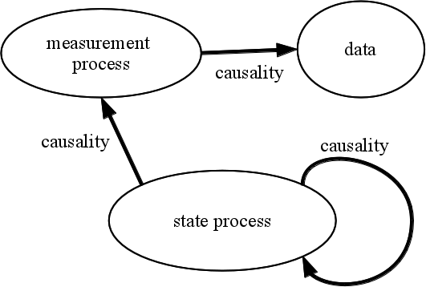

\newcommand\prob[1]{\mathbb{P}\left[{#1}\right]}
\newcommand\expect[1]{\mathbb{E}\left[{#1}\right]}
\newcommand\var[1]{\mathrm{Var}\left[{#1}\right]}
\newcommand\dist[2]{\mathrm{#1}\left(#2\right)}
\newcommand\dlta[1]{{\Delta}{#1}}
\newcommand\lik{\mathcal{L}}
\newcommand\loglik{\ell}

[Licensed under the Creative Commons Attribution-NonCommercial license](http://creativecommons.org/licenses/by-nc/4.0/).
Please share and remix noncommercially, mentioning its origin.  


Produced in **R** version `r getRversion()` using **pomp** version `r packageVersion("pomp")`.

```{r knitr-opts,include=FALSE,purl=FALSE,cache=FALSE}
library(knitr)
prefix <- "intro"
opts_chunk$set(
  progress=TRUE,
  prompt=FALSE,tidy=FALSE,highlight=TRUE,
  strip.white=TRUE,
  warning=FALSE,
  message=FALSE,
  error=FALSE,
  echo=TRUE,
  cache=TRUE,
  cache.extra=list(rand_seed,R.version.string),
  results='markup',
  fig.show='asis',
  size='small',
  fig.lp="fig:",
  fig.path=paste0("figure/",prefix,"-"),
  cache.path=paste0("cache/",prefix,"-"),
  fig.pos="h!",
  fig.align='center',
  fig.height=4,fig.width=6.83,
  dpi=100,
  dev='png',
  dev.args=list(bg='transparent')
  )
options(
  keep.source=TRUE,
  encoding="UTF-8"
  )
# library(knitcitations)
# cleanbib()
# options(citation_format="pandoc")
```
```{r opts,include=FALSE,cache=FALSE}
options(stringsAsFactors=FALSE)
library(ggplot2)
theme_set(theme_bw())
set.seed(2028866059L)
```

## Introduction: ecological and epidemiological dynamics

- Ecological systems are complex, open, nonlinear, and nonstationary.
- It is useful to model them as stochastic systems.
- "Laws of Nature" are unavailable except in the most general form.
- For any observable phenomenon, multiple competing explanations are possible.
- Central scientific goals:
    - Which explanations are most favored by the data?
    - Which kinds of data are most informative?
- Central applied goals:
    - How to design ecological or epidemiological intervention?
    - How to make accurate forecasts?
- Time series are particularly useful sources of data.


### Noisy clockwork: Time series analysis of population fluctuations in animals

##### Six problems of @Bjornstad2001

Obstacles for **ecological** modeling and inference via nonlinear mechanistic models:

1. Combining measurement noise and process noise.
2. Including covariates in mechanistically plausible ways.
3. Using continuous-time models.
4. Modeling and estimating interactions in coupled systems. 
5. Dealing with unobserved variables.
6. Modeling spatial-temporal dynamics.

The same issues arise for **epidemiological** modeling and inference via nonlinear mechanistic models.

## Objectives

1. To show how stochastic dynamical systems models can be used as scientific instruments.
1. To give students the ability to formulate models of their own.
1. To teach efficient approaches for performing scientific inference using POMP models.
1. To familiarize students with the **pomp** package.
1. To give students opportunities to work with such inference methods.
1. To provide documented examples for student re-use.


### Questions and answers

1. [What roles are played by asymptomatic infection and waning immunity in cholera epidemics?](http://dx.doi.org/10.1038/nature07084)
7. [Do subclinical infections of pertussis play an important epidemiological role?](http://dx.doi.org/10.1371/journal.pone.0072086)
3. [What explains the seasonality of measles?](http://dx.doi.org/10.1098/rsif.2009.0151)
2. [What is the contribution to the HIV epidemic of dynamic variation in sexual behavior of an individual over time? How does this compare to the role of heterogeneity between individuals?](http://dx.doi.org/10.1093/aje/kwv044)
5. [What explains the interannual variability of malaria?](http://dx.doi.org/10.1371/journal.pcbi.1000898)
6. [What will happen next in an Ebola outbreak?](http://dx.doi.org/10.1098/rspb.2015.0347)

-------------------------------

## Partially observed Markov process (POMP) models

* Data $y^*_1,\dots,y^*_N$ collected at times $t_1<\dots<t_N$ are modeled as noisy and incomplete observations of a Markov process $\{X(t), t\ge t_0\}$.
* This is a __partially observed Markov process (POMP)__ model, also known as a hidden Markov model or a state space model.
* $\{X(t)\}$ is Markov if the history of the process, $\{X(s), s\le t\}$, is uninformative about the future of the process, $\{X(s), s\ge t\}$, given the current value of the process, $X(t)$. 
* If all quantities important for the dynamics of the system are placed in the __state__, $X(t)$, then the Markov property holds by construction.
* POMP models can include all the features desired by @Bjornstad2001.

------------------------------

### Schematic of the structure of a POMP

showing causal relations.
   


```{r ssdiag1,echo=FALSE,purl=FALSE,fig.height=3,fig.width=6,fig.show='hide'}
library(grid)
library(gridExtra)
vp <- viewport(x=unit(0.5,"npc"),y=unit(0.54,"npc"),
               width=unit(0.96,"npc"),height=unit(0.96,"npc"))
pushViewport(vp)

grid.ellipse(x=0.5,y=0.2,angle=0,ar=2.5,size=20,gp=gpar(lwd=2,col='black'))
grid.text(x=0.5,y=0.2,label="state process",gp=gpar(fontsize=16,fontface='bold'))

grid.ellipse(x=0.2,y=0.7,angle=0,ar=2.5,size=18,gp=gpar(lwd=2,col='black'))
grid.text(x=0.2,y=0.7,label="measurement\n process",gp=gpar(fontsize=16,fontface='bold'))

grid.ellipse(x=0.7,y=0.8,angle=0,ar=1.5,size=16,gp=gpar(lwd=2,col='black'))
grid.text(x=0.7,y=0.8,label="data",gp=gpar(fontsize=16,fontface='bold'))

popViewport()
```

**The key perspective to keep in mind is that the model is to be viewed as the process that generated the data.**

------------------------------

#### The Markov assumption

- $\prob{X_n|X_0,\dots,X_{n-1}}=\prob{X_n|X_{n-1}}$.
- Interpretation: knowledge of the system's state at any point in time is sufficient to determine the distribution of possible futures.
- Alternative interpretation: the system's state is sufficiently rich so as to encompass all important features of the system's history
- Systems with delays can usually be rewritten as Markovian systems, at least approximately.
- An important special case: any system of differential equations is Markovian.

------------------------------

#### Notation for partially observed Markov process models

* Write $X_n=X(t_n)$ and $X_{0:N}=(X_0,\dots,X_N)$. Let $Y_n$ be a random variable modeling the observation at time $t_n$.

* The one-step transition density, $f_{X_n|X_{n-1}}(x_n|x_{n-1};\theta)$, together with the measurement density, $f_{Y_n|X_n}(y_n|x_n;\theta)$ and the initial density, $f_{X_0}(x_0;\theta)$, specify the entire joint density via

$$f_{X_{0:N},Y_{1:N}}(x_{0:N},y_{1:N};\theta) = f_{X_0}(x_0;\theta)\,\prod_{n=1}^N\!f_{X_n | X_{n-1}}(x_n|x_{n-1};\theta)\,f_{Y_n|X_n}(y_n|x_n;\theta).$$

* The marginal density for sequence of measurements, $Y_{1:N}$, evaluated at the data, $y_{1:N}^*$, is

$$ f_{Y_{1:N}}(y^*_{1:N};\theta)=\int f_{X_{0:N},Y_{1:N}}(x_{0:N},y^*_{1:N};\theta)\, dx_{0:N}.$$

------------------------------

### Another POMP model schematic

showing dependence among model variables:

```{r ssdiag2,echo=FALSE,purl=FALSE,fig.height=3,fig.width=6}
library(grid)
vp <- viewport(x=unit(0.5,"npc"),y=unit(0.54,"npc"),
               width=unit(0.96,"npc"),height=unit(0.96,"npc"))
pushViewport(vp)

fs <- 12
x1 <- 0.6; y1 <- 0.88
gp <- gpar(lty=2,col=grey(0.6),fontsize=12)
grid.text(x=x1,y=y1,label="measurement model",just="centre",gp=gpar(fontsize=fs,col=grey(0.6)))
grid.lines(x=unit(c(x1,3/12),"npc")+unit(c(0,2),"points"),y=unit(c(y1,1/2),"npc")+unit(c(-fs/2,0),"points"),gp=gp)
grid.lines(x=unit(c(x1,6/12),"npc")+unit(c(0,2),"points"),y=unit(c(y1,1/2),"npc")+unit(c(-fs/2,0),"points"),gp=gp)
grid.lines(x=unit(c(x1,8/12),"npc")+unit(c(0,-2),"points"),y=unit(c(y1,1/2),"npc")+unit(c(-fs/2,0),"points"),gp=gp)
grid.lines(x=unit(c(x1,10/12),"npc")+unit(c(0,-2),"points"),y=unit(c(y1,1/2),"npc")+unit(c(-fs/2,0),"points"),gp=gp)

x1 <- 0.4; y1 <- 0.14
grid.text(x=x1,y=y1,label="process model",just="centre",gp=gp)
grid.lines(x=unit(c(x1,4/24),"npc"),y=unit(c(y1,1/3),"npc")+unit(c(fs/2,-fs/4),"points"),gp=gp)
grid.lines(x=unit(c(x1,23/72),"npc"),y=unit(c(y1,1/3),"npc")+unit(c(fs/2,-fs/4),"points"),gp=gp)
grid.lines(x=unit(c(x1,31/72),"npc"),y=unit(c(y1,1/3),"npc")+unit(c(fs/2,-fs/4),"points"),gp=gp)
grid.lines(x=unit(c(x1,14/24),"npc"),y=unit(c(y1,1/3),"npc")+unit(c(fs/2,-fs/4),"points"),gp=gp)
grid.lines(x=unit(c(x1,18/24),"npc"),y=unit(c(y1,1/3),"npc")+unit(c(fs/2,-fs/4),"points"),gp=gp)
grid.lines(x=unit(c(x1,65/72),"npc"),y=unit(c(y1,1/3),"npc")+unit(c(fs/2,-fs/4),"points"),gp=gp)

grid.text(x=1/72,y=c(1/3,2/3),label=c("states","observations"),just="centre",rot=90,gp=gp)

x1 <- unit(c(1,3,6,8,10,3,6,8,10)/12,"npc")
y1 <- unit(c(rep(1,5),rep(2,4))/3,"npc")
w <- unit(1/12,"npc")
h <- unit(1/6,"npc")

grid.lines(x=c(1/48,47/48),y=1/12,arrow=arrow(length=unit(0.02,"npc")))
grid.text(x=x1[1:5],y=1/24,label=c(expression(italic(t[0])),expression(italic(t[1])),expression(italic(t[n-1])),expression(italic(t[n])),expression(italic(t[n+1]))))

grid.rect(x=x1,y=y1,width=w,height=h,just=c(0.5,0.5),gp=gpar(fill="white",lwd=2))
grid.text(x=x1,y=y1,label=c(
  expression(italic(X[0])),expression(italic(X[1])),
  expression(italic(X[n-1])),expression(italic(X[n])),
  expression(italic(X[n+1])),
  expression(italic(Y[1])),expression(italic(Y[n-1])),
  expression(italic(Y[n])),expression(italic(Y[n+1]))),
  gp=gpar(fontface=3))
grid.text(x=c(4.5,11.5)/12,y=unit(1/3,"npc")+unit(2,"point"),label=quote(phantom(0)~cdots~phantom(0)),gp=gpar(fontsize=15))
grid.lines(x=c(1,3)/12+c(1,-1)/24,y=1/3,arrow=arrow(length=unit(0.02,"npc")),gp=gpar(lwd=2))
grid.lines(x=c(3,4)/12+c(1,1/3)/24,y=1/3,arrow=arrow(length=unit(0.02,"npc")),gp=gpar(lwd=2))
grid.lines(x=c(5,6)/12+c(-1/3,-1)/24,y=1/3,arrow=arrow(length=unit(0.02,"npc")),gp=gpar(lwd=2))
grid.lines(x=c(6,8)/12+c(1,-1)/24,y=1/3,arrow=arrow(length=unit(0.02,"npc")),gp=gpar(lwd=2))
grid.lines(x=c(8,10)/12+c(1,-1)/24,y=1/3,arrow=arrow(length=unit(0.02,"npc")),gp=gpar(lwd=2))
grid.lines(x=c(10,11)/12+c(1,1/3)/24,y=1/3,arrow=arrow(length=unit(0.02,"npc")),gp=gpar(lwd=2))
grid.lines(x=3/12,y=c(1,2)/3+c(1,-1)/12,arrow=arrow(length=unit(0.02,"npc")),gp=gpar(lwd=2))
grid.lines(x=6/12,y=c(1,2)/3+c(1,-1)/12,arrow=arrow(length=unit(0.02,"npc")),gp=gpar(lwd=2))
grid.lines(x=8/12,y=c(1,2)/3+c(1,-1)/12,arrow=arrow(length=unit(0.02,"npc")),gp=gpar(lwd=2))
grid.lines(x=10/12,y=c(1,2)/3+c(1,-1)/12,arrow=arrow(length=unit(0.02,"npc")),gp=gpar(lwd=2))

popViewport()
```

The state process, $X_n$, is Markovian, i.e.,
$$\prob{X_n|X_0,\dots,X_{n-1},Y_1,\dots,Y_{n-1}}=\prob{X_n|X_{n-1}}.$$
Moreover, the measurements, $Y_n$, depend only on the state at that time:
$$\prob{Y_n|X_0,\dots,X_{n},Y_1,\dots,Y_{n-1}}=\prob{Y_n|X_{n}},$$
for all $n=1,\dots,N$.

------------------------------

To think algorithmically, we define some function calls:

* `rprocess( )`: a draw from $f_{X_n|X_{n-1}}(x_n| x_{n-1};\theta)$
* `dprocess( )`: evaluation of $f_{X_n|X_{n-1}}(x_n| x_{n-1};\theta)$
* `rmeasure( )`: a draw from $f_{Y_n|X_n}(y_n| x_n;\theta)$
* `dmeasure( )`: evaluation of $f_{Y_n|X_n}(y_n| x_n;\theta)$
* `initializer( )`: a draw from $f_{X_0}(x_0;\theta)$

### What does it mean for methodology to be __simulation-based__?

* Simulating random processes is often much easier than evaluating their transition probabilities.
* In other words, we may be able to write `rprocess()` but not `dprocess()`.
*  __Simulation-based__ methods require the user to specify `rprocess()` but not `dprocess()`.
* __Plug-and-play__, __likelihood-free__ and __equation-free__ are alternative terms for "simulation-based" methods.
* Much development of simulation-based statistical methodology has occurred in the past decade.


## The **pomp** package for POMP models

* **pomp** is an  **R**  package for data analysis using partially observed Markov process (POMP) models.

* Note the distinction: lower case **pomp** is a software package; 
upper case POMP is a class of models.

* **pomp** builds methodology for POMP models in terms of arbitrary user-specified `rprocess()`, `dprocess()`, `rmeasure()`, and `dmeasure()` functions.
 
* Following modern practice, most methodology in **pomp** is simulation-based, so does not require specification of `dprocess()`.

* **pomp** has facilities to help construct `rprocess()`, `rmeasure()`, and `dmeasure()` functions for model classes of epidemiological interest.

* **pomp** provides a forum for development, modification and sharing of models, methodology and data analysis workflows.

The following diagrams show the structure of a POMP model schematically.


### Example

#### The deterministic Ricker map

The Ricker map describes the deterministic dynamics of a simple population:
$$N_{t+1} = r\,N_{t}\,\exp(-N_{t})$$
Here, $N_t$ is the population density at time $t$ and $r$ is a fixed value (a parameter), related to the population's intrinsic capacity to increase.
$N$ is a *state variable*, $r$ is a *parameter*.
If we know $r$ and the *initial condition* $N_0$, the deterministic Ricker equation predicts the future population density at all times $t=1,2,\dots$.
We can view the initial condition, $N_0$ as a special kind of parameter, an *initial-value parameter*.

#### Process noise

We can model process noise in this system by making the growth rate $r$ into a random variable.
For example, if we assume that the intrinsic growth rate is log-normally distributed, $N$ becomes a stochastic process governed by
$$N_{t+1} = r\,N_{t}\,\exp(-N_{t}+\varepsilon_{t}), \qquad \varepsilon_{t}\;\sim\;\dist{Normal}{0,\sigma},$$
where the new parameter $\sigma$ is the standard deviation of the noise process $\varepsilon$.

#### Measurement error

Let's suppose that the Ricker model is our model for the dynamics of a real population.
However, we cannot know the exact population density at any time, but only estimate it through sampling.

Let's model measurement error by assuming the measurements, $y_t$, are Poisson with mean $\phi\,N_t$:
$$y_{t}\;\sim\;\dist{Poisson}{\phi\,N_{t}}$$

In this equation,

1. $N_t$ is the true population density at time $t$,
2. $y_t$ is the number of individuals sampled at time $t$,
3. the choice of units for $N$ is peculiar and depends on the parameters (e.g., $N=\log(r)$ is the equilibrium of the deterministic model),
4. the parameter $\phi$ is proportional to our sampling effort, and also has peculiar units.

### Working with the Ricker model in **pomp**.

The  **R**  package **pomp** provides facilities for modeling POMPs, a toolbox of statistical inference methods for analyzing data using POMPs, and a development platform for implmenting new POMP inference methods.
The basic data-structure provided by **pomp** is the *object of class* `pomp`, alternatively known as a `pomp` object.
It is a container that holds real or simulated data and a POMP model, possibly together with other information such as model parameters, that may be needed to do things with the model and data.

Let's see what can be done with a `pomp` object.
First, we'll load some packages, including **pomp**.
```{r prelims,cache=F}
library(ggplot2)
library(reshape2)
library(pomp)
stopifnot(packageVersion("pomp")>="1.4.9")
```

A pre-built `pomp` object encoding the Ricker model comes included with the package.
Load it by
```{r load-ricker,cache=FALSE,results="hide"}
pompExample(ricker)
```
This has the effect of creating a `pomp` object named `ricker` in your workspace.
We can plot the data by doing
```{r plot-ricker}
plot(ricker)
```
We can simulate by doing
```{r sim-ricker1}
x <- simulate(ricker)
```
What kind of object have we created?
```{r}
class(x)
plot(x)
```
Why do we see more time series in the simulated `pomp` object?

We can turn a `pomp` object into a data frame:
```{r}
y <- as.data.frame(ricker)
head(y)
head(simulate(ricker,as.data.frame=TRUE))
```

We can also run multiple simulations simultaneously:
```{r}
x <- simulate(ricker,nsim=10)
class(x)
sapply(x,class)
x <- simulate(ricker,nsim=10,as.data.frame=TRUE)
head(x)
str(x)
```
Also,
```{r fig.height=8}
x <- simulate(ricker,nsim=9,as.data.frame=TRUE,include.data=TRUE)
ggplot(data=x,aes(x=time,y=y,group=sim,color=(sim=="data")))+
  geom_line()+guides(color=FALSE)+
  facet_wrap(~sim,ncol=2)
```

We refer to the deterministic map as the "skeleton" of the stochastic map.
We can compute a trajectory of the the deterministic skeleton using `trajectory`:
```{r traj-ricker}
y <- trajectory(ricker)
dim(y)
dimnames(y)
plot(time(ricker),y["N",1,],type="l")
```


More information on manipulating and extracting information from `pomp` objects can be viewed in the help pages (`methods?pomp`).

There are a number of other examples included with the package.
Do `pompExample()` to see a list of these.
More examples can be found in the **pompExamples** package:
```{r pompExamples,eval=F,purl=F}
library(pompExamples)
pompExample()
```

### Inference algorithms in **pomp**

**pomp** provides a wide range of inference algorithms.
We'll learn about these in detail soon, but for now, let's just look at some of their general features.

The `pfilter` function runs a simple particle filter.
It can be used to evaluate the likelihood at a particular set of parameters.
One uses the `Np` argument to specify the number of particles to use:
```{r pfilter1}
pf <- pfilter(ricker,Np=1000)
class(pf)
plot(pf)
logLik(pf)
```

Note that `pfilter` returns an object of class `pfilterd.pomp`.
This is the general rule: inference algorithms return objects that are `pomp` objects with additional information.
The package provides tools to extract this information.
We can run the particle filter again by doing
```{r pfilter2}
pf <- pfilter(pf)
logLik(pf)
```
which has the result of running the same computation again.
Note that, because the particle filter is a Monte Carlo algorithm, we get a slightly different estimate of the log likelihood.

Note that, by default, running `pfilter` on a `pfilterd.pomp` object causes the computation to be re-run with the same parameters as before.
Any additional arguments we add override these defaults.
This is the general rule in **pomp**.
For example,
```{r pfilter3}
pf <- pfilter(pf,Np=100)
logLik(pf)
```
Here, the particle filtering has been performed with only `r unique(pf@Np)` particles.

### Building a custom `pomp` object

The usefulness of **pomp** in scientific research hinges on its facilities for implementing the full range of POMP models.
To get started building custom `pomp` models, see this [introductory tutorial](./ricker.html).


#### A note on terminology

If we know the state, $x(t_0)$, of the system at time $t_0$, it makes sense to speak about the entire trajectory of the system for all $t>t_0$.
This is true whether we are thinking of the system as deterministic or stochastic.
Of course, in the former case, the trajectory is uniquely determined by $x(t_0)$, while in the stochastic case, only the probability distribution of $x(t)$, $t>t_0$ is determined.
To avoid confusion, we use the term "trajectory" exclusively to refer to *trajectories of a deterministic process*.
Thus, the `trajectory` command iterates or integrates the deterministic skeleton forward in time, returning the unique trajectory determined by the specified parameters.
When we want to speak about sample paths of a stochastic process, we use the term *simulation*.
Accordingly, the `simulate` command always returns individual sample paths from the POMP.
In particular, we avoid "simulating a set of differential equations", preferring instead to speak of "integrating" the equations, or "computing trajectories".

------------------------------

## [Back to course homepage](http://kingaa.github.io/sbied)
## [**R** codes for this document](http://raw.githubusercontent.com/kingaa/sbied/gh-pages/intro/intro.R)

----------------------

## References
