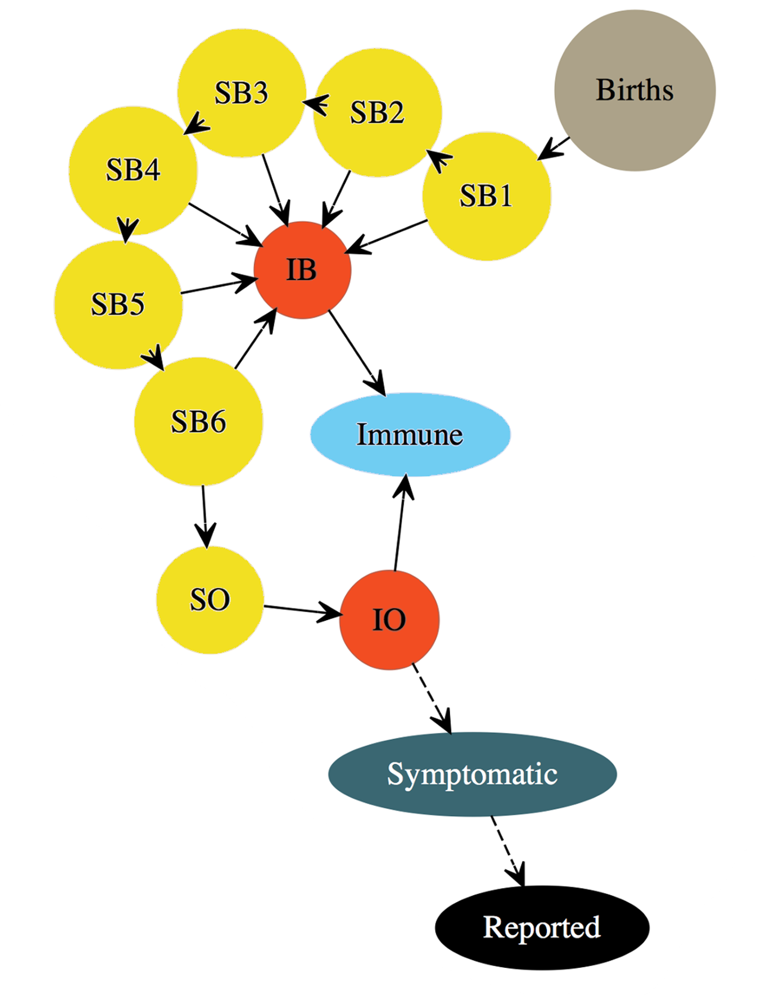

Licensed under the Creative Commons attribution-noncommercial license, http://creativecommons.org/licenses/by-nc/3.0/.
Please share and remix noncommercially, mentioning its origin.  


```{r opts,include=FALSE}
library(pomp)
library(knitr)
prefix <- "polio"
opts_chunk$set(
  progress=TRUE,
  prompt=FALSE,tidy=FALSE,highlight=TRUE,
  strip.white=TRUE,
  warning=FALSE,
  message=FALSE,
  error=FALSE,
  echo=TRUE,
  cache=TRUE,
  results='markup',
  fig.show='asis',
  size='small',
  fig.lp="fig:",
  fig.path=paste0("figure/",prefix,"-"),
  cache.path=paste0("cache/",prefix,"-"),
  fig.pos="h!",
  fig.align='center',
  fig.height=4,fig.width=6.83,
  dpi=300,
  dev='png',
  dev.args=list(bg='transparent')
  )

options(
  pomp.cache="cache",
  keep.source=TRUE,
  encoding="UTF-8"
  )

library(ggplot2)
theme_set(theme_bw())
```


## Objectives

This is one of a [series of tutorials](http://dept.stat.lsa.umich.edu/~ionides/tutorials/index.html) on time series analysis using mechanistic modeling.

1. Show how partially observed Markov process (POMP) methods can be used to understand transmission dynamics of polio.

2. More broadly, discuss the use of POMP methods for compartmental models for biological systems having age structure, seasonality and other covariates.

3. Get some practice maximizing the likelihood for such models. How does one set up a _global_ search for a maximum likelihood estimate (MLE)? How does one test whether such a search has been successful?

## Introduction

The massive global polio eradication initiative (GPEI) has brought polio from a major global disease to the brink of extinction. Finishing this task is proving hard, and improved understanding polio ecology might assist.  @martinez-bakker15 investigated this using extensive state level pre-vaccination era data in USA. We will follow the approach of @martinez-bakker15 for one state (Wisconsin). In the context of their model, we can quantify seasonality of transmission, the role of the birth rate in explaining the transmission dynamics, and the persistence mechanism of polio. @martinez-bakker15 carrried out this analysis for all 48 contigous states and District of Columbia, and their data and code are all publicly available. The data we study, in [polio_wisconsin.csv](polio_wisconsin.csv), consist of `cases`, the monthly reported polio cases; `births`, the  monthly recorded births; `pop`, the annual census; `time`, date in years.
 
```{r data}
polio_data <- read.table("polio_wisconsin.csv")
colnames(polio_data)
```

We implement the compartment model of @martinez-bakker15, having compartments representing susceptible babies in each of six one-month birth cohorts ($S^B_1$,...,$S^B_6$), susceptible older individuals ($S^O$), infected babies ($I^B$), infected older individuals ($I^O$), and recovered with lifelong immunity ($R$). The state vector of the disease transmission model consists of numbers of individuals in each compartment at each time, 
$$X(t)=\big(S^B_1(t),...,S^B_6(t), I^B(t),I^O(t),R(t) \big).$$
 Babies under six months are modeled as fully protected from symptomatic poliomyelitis; older infections lead to reported cases (usually paralysis) at a rate $\rho$. 

The flows through the compartments are graphically represented as follows (Figure 1A of @martinez-bakker15):



Since duration of infection is comparable to the one-month reporting aggregation, a discrete time model may be appropriate. @martinez-bakker15 fitted monthly observations from May 1932 through January 1953, so we define $t_n=1932+ (4+n)/12$ for $n=0,\dots,N$, and we write
$$X_n=X(t_n)=\big(S^B_{1,n},...,S^B_{6,n}, I^B_n,I^O_n,R_n \big).$$
The mean force of infection, in units of $\mathrm{yr}^{-1}$, is modeled as
$$\bar\lambda_n=\left( \beta_n \frac{I^O_n+I^B_n}{P_n} + \psi \right)$$
where $P_n$ is census population interpolated to time $t_n$ and seasonality of transmission is modeled as
$$\beta_n=\exp\left\{ \sum_{k=1}^K b_k\xi_k(t_n) \right\},$$
with $\{\xi_k(t),k=1,\dots,K\}$ being a periodic B-spline basis. We set $K=6$. The force of infection has a stochastic perturbation,
$$\lambda_n = \bar\lambda_n \epsilon_n,$$
where $\epsilon_n$ is a Gamma random variable with mean 1 and variance $\sigma^2_{\mathrm{env}} + \sigma^2_{\mathrm{dem}}\big/\bar\lambda_n$. These two terms capture variation on the environmental and demographic scales, respectively. All compartments suffer a mortality rate, set at $\delta=1/60\mathrm{yr}^{-1}$. 
Within each month, all susceptible individuals are modeled as having exposure to constant competing hazards of mortality and polio infection.  The chance of remaining in the susceptible population when exposed to these hazards for one month is therefore
$$p_n = \exp\big\{ -(\delta+\lambda)/12\big\},$$
with the chance of polio infection being 
$$q_n = (1-p_n)\lambda_n\big/(\lambda_n+\delta).$$
We employ a continuous population model, with no demographic stochasticity (in some sense, the demographic-scale stochasticity in $\lambda_n$ is in fact environmental stochasticity since it modifies a rate that affects all compartments equally). Writing $B_n$ for births in month $n$, we obtain the dynamic model of @martinez-bakker15:
$$\begin{array}{rcl}
S^B_{1,n+1}&=&B_{n+1}\\
S^B_{k,n+1}&=&p_nS^B_{k-1,n} \quad\mbox{for $k=2,\dots,6$}\\
S^O_{n+1}&=& p_n(S^O_n+S^B_{6,n})\\
I^B_{n+1}&=& q_n \sum_{k=1}^6 S^B_{k,n}\\
I^O_{n+1}&=& q_n S^O_n
\end{array}$$
The model for the reported observations, conditional on the state, is a discretized normal distribution truncated at zero, with both environmental and Poisson-scale contributions to the variance:
$$Y_n= \max\{\mathrm{round}(Z_n),0\}, \quad Z_n\sim\mathrm{normal}\left(\rho I^O_n, \big(\tau  I^O_n\big)^2 + \rho I^O_n\right).$$
Additional parameters are used to specify initial state values at time $t_0=1932+ 4/12$. We will suppose there are parameters $\big(\tilde S^B_{1,0},...,\tilde S^B_{6,0}, \tilde I^B_0,\tilde I^O_0,\tilde S^O_0\big)$ that specify the population in each compartment at time $t_0$ via
$$ S^B_{1,0}= {\tilde S}^B_{1,0} ,...,S^B_{6,0}= \tilde S^B_{6,0}, \quad I^B_{0}= P_0 \tilde I^B_{0},\quad S^O_{0}= P_0 \tilde S^O_{0}, \quad I^O_{0}= P_0 \tilde I^O_{0}.$$
Following @martinez-bakker15, we make an approximation for the initial conditions of ignoring infant infections at time $t_0$. Thus, we set $\tilde I^B_{0}=0$ and use monthly births in the preceding months (ignoring infant mortality) to fix $\tilde S^B_{k,0}=0$ for $k=1,\dots,6$. The estimated initial conditions are then defined by the two parameters $\tilde I^O_{0}$ and $\tilde S^O_{0}$, since the initial recovered population, $R_0$, is specified by subtraction of all the other compartments from the total initial population, $P_0$. Note that it is convenient to parameterize the estimated initial states as fractions of the population, whereas the initial states fixed at births are parameterized directly as a count.


## Building a pomp object 

pomp is an R package for time series data analysis, focusing on the use of POMP models [@king15]. pomp is available from [CRAN](http://cran.r-project.org/web/packages/pomp), with development versions available from [R-Forge](http://pomp.r-forge.r-project.org). Here, we use pomp version `r packageVersion("pomp")`

```{r package}
require(pomp)
packageVersion("pomp")
```

Observations are monthly case reports, $y^*_{1:N}$, occurring at times $t_{1:N}$.  Since our model is in discrete time, we only really need to consider the discrete time state process,. However, the model and POMP methods extend naturally to the possibility of a continuous-time model specification. We code the state and observation variables, and the choice of $t_0$, as

```{r statenames} 
polio_statenames <- c("SB1","SB2","SB3","SB4","SB5","SB6","IB","SO","IO")
polio_obsnames <- "cases"
polio_t0 <- 1932+4/12
```

We do not explictly code $R$, since it is defined implicitly as the total population minus the sum of the other compartments. Due to lifelong immunity, individuals in $R$ play no role in the dynamics. Even occasional negative values of $R$ (due to a discrepancy between the census and the mortality model) would not be a fatal flaw.

Now, let's define the covariates. `time` gives the time at which the covariates are defined. `P` is a smoothed interpolation of the annual census. `B` is monthly births. The B-spline basis is coded as `xi1,...,xi6` 

```{r covariates}
polio_K <- 6
polio_tcovar <- polio_data$time
polio_bspline_basis <- periodic.bspline.basis(polio_tcovar,nbasis=polio_K,degree=3,period=1)
colnames(polio_bspline_basis)<- paste("xi",1:polio_K,sep="")
covartable <- data.frame(
  time=polio_tcovar,
  polio_bspline_basis,
  B=polio_data$births,
  P=predict(smooth.spline(x=1931:1954,y=polio_data$pop[12*(1:24)]),
               x=polio_tcovar)$y
)
```

The parameters $b_1,\dots,b_\mathrm{K},\psi,\rho,\tau,\sigma_\mathrm{dem}, \sigma_\mathrm{env}$  in the model above are _regular parameters_ (RPs), meaning that they are real-valued parameters that affect the dynamics and/or the measurement of the process.  These regular parameters are coded as

```{r rp_names} 
polio_rp_names <- c("b1","b2","b3","b4","b5","b6","psi","rho","tau","sigma_dem","sigma_env")
```

The _initial value parameters_ (IVPs), $\tilde I^O_{0}$ and  $\tilde S^O_{0}$, are coded for each state named by adding `_0` to the state name:

```{r ivp_names} 
polio_ivp_names <- c("SO_0","IO_0")
polio_paramnames <- c(polio_rp_names,polio_ivp_names)
```

Finally, there are two quantities in the dynamic model specification, $\delta=1/60 \mathrm{yr}^{-1}$ and $\mathrm{K}=6$, that we are not estimating. In addition, there are six other initial value quantities, $\{\tilde S^B_{1,0},\dots,\tilde S^B_{6,0}\}$, which are treating as _fixed parameters_ (FPs). 

```{r fixed_names} 
polio_fp_names <- c("delta","K","SB1_0","SB2_0","SB3_0","SB4_0","SB5_0","SB6_0")
polio_paramnames <- c(polio_rp_names,polio_ivp_names,polio_fp_names)
```

Alternatively, these fixed quantities could be passed as constants using the `globals` argument of `pomp`. We can check how the initial birth parameters are set up:

```{r polio_check_fixed}
covar_index_t0 <- which(abs(covartable$time-polio_t0)<0.01)
polio_initial_births <- as.numeric(covartable$B[covar_index_t0-0:5])
names(polio_initial_births) <- c("SB1_0","SB2_0","SB3_0","SB4_0","SB5_0","SB6_0") 
polio_fixed_params <- c(delta=1/60,K=polio_K,polio_initial_births)
```

We read in a table of previous parameter search results from `polio_params.csv`, and take the one with highest likelihood as our current estimate of an MLE. We can inspect that the fixed parameters are indeed set to their proper values.

```{r polio_read_mle}
polio_params <- data.matrix(read.table("polio_params.csv",row.names=NULL,header=TRUE))
polio_mle <- polio_params[which.max(polio_params[,"logLik"]),][polio_paramnames]
polio_mle[polio_fp_names]
polio_fixed_params
```

The process model is

```{r rprocess}
polio_rprocess <- Csnippet("
  double lambda, beta, var_epsilon, p, q;
 
  beta = exp(dot_product( (int) K, &xi1, &b1));
  lambda = (beta * (IO+IB) / P + psi);
  var_epsilon = pow(sigma_dem,2)/ lambda +  pow(sigma_env,2);
  lambda *= (var_epsilon < 1.0e-6) ? 1 : rgamma(1/var_epsilon,var_epsilon);
  p = exp(- (delta+lambda)/12);
  q = (1-p)*lambda/(delta+lambda);
  SB1 = B;
  SB2= SB1*p;
  SB3=SB2*p;
  SB4=SB3*p;
  SB5=SB4*p;
  SB6=SB5*p;
  SO= (SB6+SO)*p;
  IB=(SB1+SB2+SB3+SB4+SB5+SB6)*q;
  IO=SO*q;
")
```

The measurement model is
```{r measure}
polio_dmeasure <- Csnippet("
  double tol = 1.0e-25;
  double mean_cases = rho*IO;
  double sd_cases = sqrt(pow(tau*IO,2) + mean_cases);
  if(cases > 0.0){
    lik = pnorm(cases+0.5,mean_cases,sd_cases,1,0) - pnorm(cases-0.5,mean_cases,sd_cases,1,0) + tol; 
  } else{
    lik = pnorm(cases+0.5,mean_cases,sd_cases,1,0) + tol;
  }
  if (give_log) lik = log(lik);
")

polio_rmeasure <- Csnippet("
  cases = rnorm(rho*IO, sqrt( pow(tau*IO,2) + rho*IO ) );
  if (cases > 0.0) {
    cases = nearbyint(cases);
  } else {
    cases = 0.0;
  }
")
```

The map from the initial value parameters to the initial value of the states at time $t_0$ is coded by the initializer function:

```{r initializer}
polio_initializer <- Csnippet("
  SB1 = SB1_0;
  SB2 = SB2_0;
  SB3 = SB3_0;
  SB4 = SB4_0;
  SB5 = SB5_0;
  SB6 = SB6_0;
  IB = 0;
  IO = IO_0 * P;
  SO = SO_0 * P;
")
```

To carry out parameter estimation, it is also helpful to have transformations that map each parameter into the whole real line:

```{r trans}
polio_toEstimationScale <- Csnippet("
 Tpsi = log(psi);
 Trho = logit(rho);
 Ttau = log(tau);
 Tsigma_dem = log(sigma_dem);
 Tsigma_env = log(sigma_env);
 TSO_0 =  logit(SO_0);
 TIO_0 = logit(IO_0);
")

polio_fromEstimationScale <- Csnippet("
 Tpsi = exp(psi);
 Trho = expit(rho);
 Ttau = exp(tau);
 Tsigma_dem = exp(sigma_dem);
 Tsigma_env = exp(sigma_env);
 TSO_0 =  expit(SO_0);
 TIO_0 = expit(IO_0);
")
```

We can now put these pieces together into a pomp object. 


```{r pomp}
polio <- pomp(
  data=subset(polio_data, select=c("cases","time"),(time > polio_t0 + 0.01) & (time < 1953+1/12+0.01)),
  times="time",
  t0=polio_t0,
  params=polio_mle,
  rprocess = euler.sim(step.fun = polio_rprocess, delta.t=1/12),
  rmeasure= polio_rmeasure,
  dmeasure = polio_dmeasure,
  covar=covartable,
  tcovar="time",
  obsnames = polio_obsnames,
  statenames = polio_statenames,
  paramnames = polio_paramnames,
  covarnames = c("xi1","B","P"),
  initializer=polio_initializer,
  toEstimationScale=polio_toEstimationScale, 
  fromEstimationScale=polio_fromEstimationScale
) 
plot(polio)
```

Let's carry out a likelihood evaluation at the reported MLE.  To develop and debug code, it is nice to have a version that runs extra quickly, for which we set `run_level=1`. Here, `Np` is the number of particles (i.e., sequential Monte Carlo sample size), and `Nmif` is the number of iterations of the optimization procedure carried out below. Empirically, `Np=5000` and `Nmif=200` are around the minimum required to get stable results with an error in the likelihood of order 1 log unit for this example; this is implemented by setting `run_level=2`. One can then ramp up to larger values for more refined computations, implemented here by `run_level=3`.

```{r run_level}
run_level <- 1
polio_Np <-          c(100,5e3,1e4)
polio_Nmif <-        c(10, 200,400)
polio_Nreps_eval <-  c(2,  10,  20)
polio_Nreps_local <- c(10, 20, 40)
polio_Nreps_global <-c(10, 20, 100)
polio_Nsim <-        c(50,100, 500) 
```

Since I have a double-threaded 12-cpu machine, it is convenient to do some parallelization to generate replicated calls to `pfilter`. Notice that the replications are averaged using the `logmeanexp` function.

```{r pf1}
require(doParallel)
cores <- 20
registerDoParallel(cores)
t1 <- system.time(
  pf1 <- foreach(i=1:cores,.packages='pomp') %dopar% try(
    pfilter(polio,Np=polio_Np[run_level],seed=297221+i)
  )
)
(L1 <- logmeanexp(sapply(pf1,logLik),se=TRUE))
```

In  `r round(t1["elapsed"],1)` seconds, we obtain an unbiased likelihood estimate of `r round(L1[1],2)` with a Monte standard error of `r round(L1[2],2)`.

### Comparison  of our implementation with @martinez-bakker15

This setup has minor differences in notation, model construction and code compared to @martinez-bakker15. The MLE reported for these data by @martinez-bakker15 is -794.34 (with Monte Carlo evaluation error of 0.18) which is similar to the log likelihood at the MLE for our model (`r round(L1[1],2)` with Monte Carlo evaluation error `r round(L1[2],2)`). This suggests that the differences do not substantially improve or decrease the fit of our model compared to  @martinez-bakker15. When different calculations match reasonably closely, it demonstrates some reproducibility of both results.

### Simulation to investigate the fitted model: Local persistence

The scientific purpose of fitting a model typically involves analyzing properties of the fitted model, often investigated using simulation. Following @martinez-bakker15, we are interested in how often months with no reported cases ($Y_n=0$) correspond to months without any local asymptomatic cases, defined for our continuous state model as $I^B_n+I^O_n<1/2$. For Wisconsin, using our model at the estimated MLE, we compute as follows:

```{r persistence}
t_sim <- system.time(
 sim <- foreach(i=1:polio_Nsim[run_level],.packages='pomp') %dopar% simulate(polio,seed=1099999+i)
)

no_cases_data <- sum(obs(polio)==0)
no_cases_sim <- sum(sapply(sim,obs)==0)/length(sim)
fadeout1_sim <- sum(sapply(sim,function(po)states(po)["IB",]+states(po)["IO",]<1))/length(sim)
fadeout100_sim <- sum(sapply(sim,function(po)states(po)["IB",]+states(po)["IO",]<100))/length(sim)
imports_sim <- coef(polio)["psi"]*mean(sapply(sim,function(po) mean(states(po)["SO",]+states(po)["SB1",]+states(po)["SB2",]+states(po)["SB3",]+states(po)["SB4",]+states(po)["SB5",]+states(po)["SB6",])))/12
```

For the data, there were `r no_cases_data` months with no reported cases, in reasonable accordance with the mean of `r round(no_cases_sim,1)` for simulations from the fitted model. Months with no asyptomatic infections for the simulations were rare, on average `r round(fadeout1_sim,1)` months per simulation. Months with fewer than 100 infections averaged `r round(fadeout100_sim,1)` per simulation, which in the context of a reporting rate of `r signif(coef(polio)["rho"],3)` can explain the absences of case reports. For this model, the mean monthly infections due to importations (more specifically, due to the term $\psi$, whatever its biological interpretation) is `r round(imports_sim,1)`. This does not give much opportunity for local elimination of poliovirus. One could profile over $\psi$ to investigate how sensitive this conclusion is to values of $\psi$ consistent with the data.

It is also good practice to look at simulations from the fitted model:

```{r plot_simulated}
mle_simulation <- simulate(polio,seed=127)
plot(mle_simulation)
```

We see from this simulation that the fitted model can generate report histories that look qualitatively similar to the data. However, there are oddities in the latent states. Specifically, the pool of older susceptibles, $S^O(t)$, is mostly increasing. The reduced case burden in the data in the time interval 1932--1945 is explained by a large initial recovered ($R$) population, which implies much higher levels of polio before 1932. A liklihood profile over the parameter $\tilde S^O_0$ could help to clarify to what extent this is a critical feature of how the model explains the data.

## Likelihood maximization: A local approach


Now, let's see if we can improve on the previous MLE. We use the iterated filtering algorithm IF2 of @ionides15, which uses a random walk in parameter space to approach the MLE. We set a constant random walk standard deviation for each of the regular parameters and a larger constant for each of the initial value parameters. 

```{r mif}
polio_rw.sd_rp <- 0.02
polio_rw.sd_ivp <- 0.2
polio_cooling.fraction.50 <- 0.5

t2 <- system.time({
 m2 <- foreach(i=1:polio_Nreps_local[run_level],
   .packages='pomp', .combine=c) %dopar% try(
   mif2(polio,
     seed=143275+i,
     Np=polio_Np[run_level],
     Nmif=polio_Nmif[run_level],
     cooling.type="geometric",
     cooling.fraction.50=polio_cooling.fraction.50,
     transform=TRUE,
     rw.sd=rw.sd(
       b1=polio_rw.sd_rp,
       b2=polio_rw.sd_rp,
       b3=polio_rw.sd_rp,
       b4=polio_rw.sd_rp,
       b5=polio_rw.sd_rp,
       b6=polio_rw.sd_rp,
       psi=polio_rw.sd_rp,
       rho=polio_rw.sd_rp,
       tau=polio_rw.sd_rp,
       sigma_dem=polio_rw.sd_rp,
       sigma_env=polio_rw.sd_rp,
       IO_0=ivp(polio_rw.sd_ivp),
       SO_0=ivp(polio_rw.sd_ivp)
     )
   )
 )

 lik_m2 <- foreach(i=1:polio_Nreps_local[run_level],.packages='pomp',.combine=rbind) %dopar% {
   set.seed(87932+i)
   logmeanexp(replicate(polio_Nreps_eval[run_level], logLik(pfilter(polio,params=coef(m2[[i]]),Np=polio_Np[run_level]))),
     se=TRUE)
 }
})

r2 <- data.frame(logLik=lik_m2[,1],logLik_se=lik_m2[,2],t(sapply(m2,coef)))
if(run_level>1) write.table(r2,file="polio_params.csv",append=TRUE,col.names=FALSE,row.names=FALSE)
summary(r2$logLik,digits=5)
```

This investigation took  `r round(t2["elapsed"]/60,1)` minutes. These repeated stochastic maximizations can also show us the geometry of the likelihood surface in a neighborhood of this point estimate:

```{r pairs}
pairs(~logLik+psi+rho+tau+sigma_dem+sigma_env,data=subset(r2,logLik>max(logLik)-20))
```

We see strong tradeoffs between $\psi$, $\rho$ and $\sigma_\mathrm{dem}$. By itself, in the absence of other assumptions, the pathogen immigration rate $\psi$ is fairly weakly identified. However, the reporting rate $\rho$ is essentially the fraction of poliovirus infections leading to acute flaccid paralysis, which is known to be around 1%. This plot suggests that fixing an assumed value of $\rho$ might lead to much more precise inference on $\psi$; the rate of pathogen immigration presumably being important for understanding disease persistence. These hypotheses could be investigated more formally by construction of profile likelihood plots and likelihood ratio tests.


## Likelihood maximization: parameter estimation using randomized starting values.

When carrying out parameter estimation for dynamic systems, we need to specify beginning values for both the dynamic system (in the state space) and the parameters (in the parameter space). By convention, we use  _initial values_ for the initialization of the dynamic system and _starting values_ for initialization of the parameter search.

Practical parameter estimation involves trying many starting values for the parameters. One can specify a large box in parameter space that contains all parameter vectors which seem remotely sensible. If an estimation method gives stable conclusions with starting values drawn randomly from this box, this gives some confidence that an adequate global search has been carried out. 

For our polio model, a box containing reasonable parameter values might be

```{r box}
polio_box <- rbind(
  b1=c(-2,8),
  b2=c(-2,8),
  b3=c(-2,8),
  b4=c(-2,8),
  b5=c(-2,8),
  b6=c(-2,8),
  psi=c(0,0.1),
  rho=c(0,0.1),
  tau=c(0,0.1),
  sigma_dem=c(0,0.5),
  sigma_env=c(0,1),
  SO_0=c(0,1),
  IO_0=c(0,0.01)
)
```

We then carry out a search identical to the local one except for the starting parameter values. This can be succinctly coded by calling `mif2` on the previously constructed object, `m2[[1]]`, with a reset starting value:

```{r box_eval}
t3 <- system.time({
 m3 <- foreach(i=1:polio_Nreps_global[run_level],.packages='pomp', .combine=c) %dopar%  mif2(
      m2[[1]],
      seed=1587690+i, 
      start=c(apply(polio_box,1,function(x)runif(1,x)),polio_fixed_params)
 )
 lik_m3 <- foreach(i=1:polio_Nreps_global[run_level],.packages='pomp',.combine=rbind) %dopar% {
   set.seed(87932+i)
   logmeanexp(replicate(polio_Nreps_eval[run_level], logLik(pfilter(polio,params=coef(m3[[i]]),Np=polio_Np[run_level]))), se=TRUE)
 }
})

r3 <- data.frame(logLik=lik_m3[,1],logLik_se=lik_m3[,2],t(sapply(m3,coef)))
if(run_level>1) write.table(r3,file="polio_params.csv",append=TRUE,col.names=FALSE,row.names=FALSE)
summary(r3$logLik,digits=5)
```

Evaluation of the best result of this search gives a likelihood of `r round(max(r3$logLik),1)` with a standard error of `r round(r3$logLik_se[which.max(r3$logLik)],1)`. We see that optimization attempts from diverse remote starting points can approach our MLE, but do not exceed it. This gives us some reasonable confidence in our MLE. 


Plotting these diverse parameter estimates can help to give a feel for the global geometry of the likelihood surface 

```{r pairs_global}
pairs(~logLik+psi+rho+tau+sigma_dem+sigma_env,data=subset(r3,logLik>max(logLik)-20))
```

To understand these global searches, many of which may correspond to parameter values having no meaningful scientific interpretation, it is helpful to put the log likelihoods in the context of some non-mechanistic benchmarks.

### Benchmark likelihoods for non-mechanistic models

The most basic statistical model for data is independent, identically distributed (IID). Picking a negative binomial model, 

```{r nbinom}
nb_lik <- function(theta) -sum(dnbinom(as.vector(obs(polio)),size=exp(theta[1]),prob=exp(theta[2]),log=TRUE))
nb_mle <- optim(c(0,-5),nb_lik)
-nb_mle$value
```

we see that a model with likelihood below `r round(-nb_mle$value,1)` is unreasonable. This explains a cutoff around this value in the global searches: in these cases, the model is finding essentially IID explanations for the data.

Linear, Gaussian auto-regressive moving-average (ARMA) models provide non-mechansitic fits to the data including flexible dependence relationships. We fit to $\log(y_n^*+1)$ and correct the likelihood back to the scale appropriate for the untransformed data:

```{r arma}
log_y <- log(as.vector(obs(polio))+1)
arma_fit <- arima(log_y,order=c(2,0,2),seasonal=list(order=c(1,0,1),period=12))
arma_fit$loglik-sum(log_y)
```

This 7-parameter model, which knows nothing of susceptible depletion, attains a likelihood of `r round( arma_fit$loglik-sum(log_y),1)`. Although our goal is not to beat non-mechanstic models, it is comforting that we're competitive with them.

### Mining previous investigations of the likelihood

Saving the results of previous searches, with likelihoods that have been repeatedly evaluated by particle filters, gives a resource for building up knowledge about the likelihood surface. Above, we have added our new results to the file `polio_params.csv`, which we now investigate.

```{r param_file}
polio_params <- read.table("polio_params.csv",row.names=NULL,header=TRUE)
pairs(~logLik+psi+rho+tau+sigma_dem+sigma_env,data=subset(polio_params,logLik>max(logLik)-20))
```

Here, we see that the most successful searches have always led to models with reporting rate around 1%. This impression can be reinforced by looking at results from the global searches:

```{r global_rho}
plot(logLik~rho,data=subset(r3,logLik>max(r3$logLik)-10),log="x")
```

We see that reporting rates close to 1% seem to provide a small but clear (several units of log likelihood) advantage in explaining the data. These are the reporting rates for which depletion of susceptibles can help to explain the dynamics.

## Technical exercise: Initial values

When carrying out parameter estimation for dynamic systems, we need to specify beginning values for both the dynamic system (in the state space) and the parameters (in the parameter space). By convention, we use  _initial values_ for the initialization of the dynamic system and _starting values_ for initialization of the parameter search.

Discuss issues in specifying and inferring initial conditions, with particular reference to this polio example. 

Suggest a possible improvement in the treatment of initial conditions here, code it up and make some preliminary assessment of its effectiveness. How will you decide if it is a substantial improvement? 
 
## Technical exercise: Parameter estimation using randomized starting values.

Comment on the computations above, for parameter estimation using randomized starting values. Propose and try out at least one modification of the procedure. How could one make a formal statement quantifying the error of the optimization procedure?

## Technical exercise: Demography and discrete time

It can be surprisingly hard to include birth, death, immigration, emmigration and aging into a disease model in satisfactory ways. Consider the strengths and weaknesses of the analysis presented. For example, how does it compare to a continuous-time model? In an imperfect world, it is nice to check the extent to which the conclusions are insensitive to alternative modeling decisions. If you have some ideas to change the treatmentof demography (or an other aspect of the model) you could have a go at coding it up to see if it makes a difference.

## Technical exercise: Diagnosing filtering and maximization convergence

Are there outliers in the data (i.e., observations that do not fit well with our model)? Are we using unnecessarily large amounts of computer time to get our results? Are there indications that we would should run our computations for longer? Or maybe with different choices of algorithmic settings?

In particular, `cooling.fraction.50` gives the fraction by which the random walk standard deviation is decreased ("cooled") in 50 iterations. If `cooling.fraction.50` is too small, the search will "freeze" too soon, evidenced by flat parallel lines in the convergence diagnostics. If `cooling.fraction.50` is too large, the researcher may run of of time, patience or computing budget (or all three) before the parameter trajectories approach an MLE.

Interpret the diagnostic plots below. Carry out some numerical experiments to test your interpretations. 

One could look at filtering diagnostics at the MLE, for example, `plot(pf1[[1]])` but the diagnostic plots for iterated filtering include filtering diagnostics for the last iteration anyhow, so let's just consider the `mif` diagnostic plot. Looking at several simultaneously permits assessment of Monte Carlo variability. `plot` applied to a `mifList` object does this: here, `m3` is of class `mifList` since that is the class resulting from concatenation of `mif2d.pomp` objects using `c()`:

```{r check_class_m3}
class(m3)
```

```{r check_class_m3_1}
class(m3[[1]])
```

```{r mif_diagnostics}
plot(m3[r3$logLik>max(r3$logLik)-10])
```

The likelihood is particularly important to keep in mind. If parameter estimates are numerically unstable, that could be a consequence of a weakly identified parameter subspace. The presence of some weakly identified combinations of parameters is not fundamentally a scientific flaw; rather, our scientific inquiry looks to investigate which questions can and cannot be answered in the context of a set of data and modeling assumptions. Thus, as long as the search is demonstrably approaching the maximum likelihood region we should not necessarily be worried about the stability of parameter values (at least, from the point of diagnosing successful maximization). So, let's zoom in on the likelihood convergence:

```{r likelihood_convergence}
loglik_convergence <- do.call(cbind,conv.rec(m3[r3$logLik>max(r3$logLik)-10],"loglik"))
matplot(loglik_convergence,type="l",lty=1,ylim=max(loglik_convergence,na.rm=T)+c(-10,0))
```

```{r save, include=FALSE}
if(run_level>1) save(list = ls(all = TRUE), file = "Rout.rda")
```

----------------------


## References


